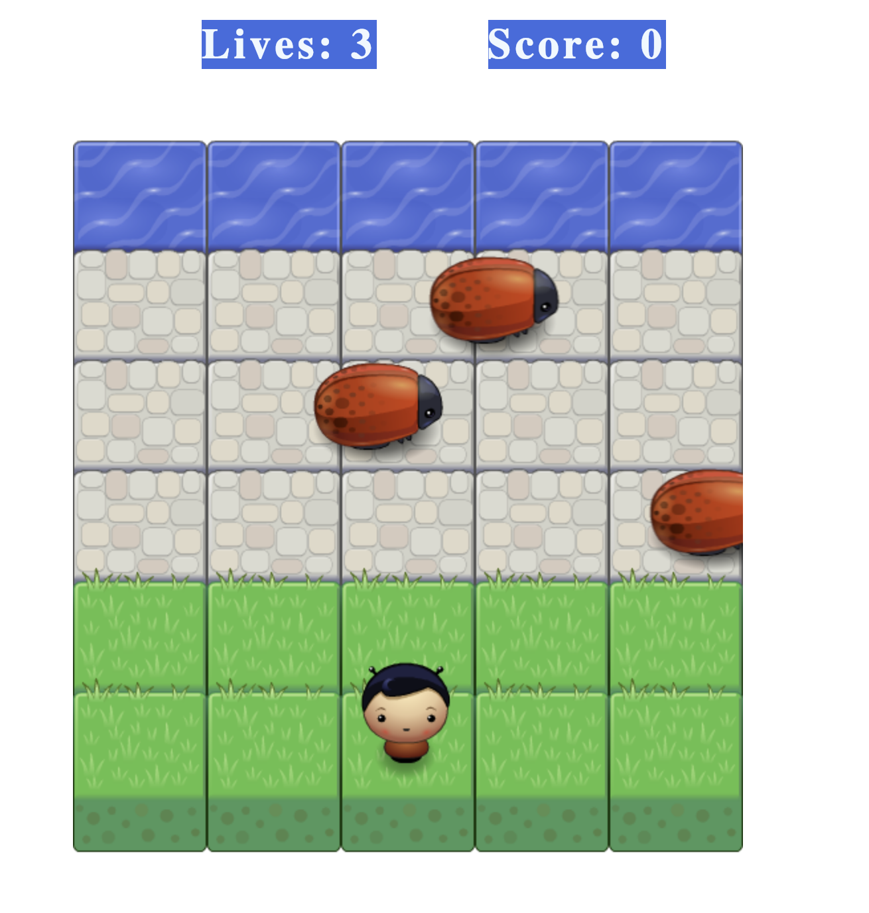

# Classic Arcade Game (Udacity Project)
This is the third project from Udacity Front-end Development Nanodegree.

## What is a Arcade Game
It is a simple game to move to the other side of the map without getting hit by enemies. There's isn't a time limit and the objetive is to get the most point possible before losing all lives.

## Game explanation
The objetive is to cross to the other side without getting hit and get has many points possible.

## How to Play
- Clone the repository using this command: `git clone https://github.com/cesar18pena/arcade-game.git`
- Open the index.html and start playing.

## Instructions
- Move the player using the keyboard arrows up, down, right, left
- Make sure your player doesn't collide with the enemies. You loose a life with any collison.
